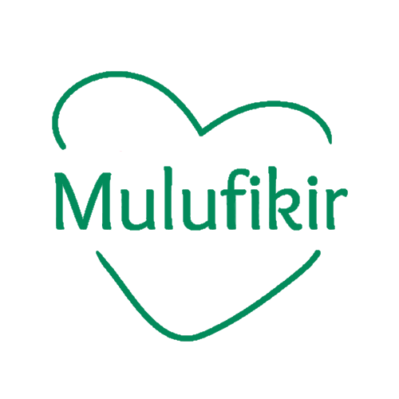

# sivusto-ohjaus

### Värit (Muutettavissa) (11:01 21/10)

`#028b5b` - Tausta

`#01613F` - Etutausta 

`#ffffff` - Teksti

`#49BF95` - Header

`#49BF95` - Footer

Font - Roboto Slab?

### Käytettyjä lähteitä

Löysimme arkistoista entisen Mulufikir sivuston

https://web.archive.org/web/20180110144823/https://mulufikir.org/

Sivustossa käytettäviä elementtejä (Ei välttämättä käytetä)

https://lordicon.com/help/32-web-lordicon-custom-element

Hetzner Palvelin
------- 
Hetznerillä on myös palvelimia suomessa, joka mahdollistaa kaikki suomen ja Euroopan internetti turvallisuus lakien noudutuksen. 

Hetzner on yksi maailman tunnetuimista ja luotetuimmista palvelimen tarjoojista.

Hetznerin hinnat ovat todella kilpailu kykyisiä verrattuna samantapaisiin palvelimen tarjoajiin. 

Palvelimen maksua pystyy maksamaan kolmen kuukauden tai jopa vuoden erissä, jotta teidän ei tarvitse muistaa maksaa joka kuukausi palvelimesta. 

Hetzner myös muistuttaa sähköpostilla palvelimen maksusta, jotta et unohda maksaa sitä. 

Hetznerin tämän hetkinen hinta on € 4.51 / kuukausi

------- 

OVH ja Hostinger ovat olleet meidän vertailukuviamme. 

------ 

Hetzner on kilpailu kykyinen palvelimen tarjoaja, joka pystyy tarjoamaan halvimmat hinnat, koska he ovat olleet markkinoilla todella kauan. 

------ 

Löysimme alkuperäiset sivut käyttämällä archive.org, joka myös tunnetaan nimellä waybackmachine, tämän avulla saimme jonkinlaista taustatietoa vanhoista sivuista, kuten vanhat etusivut, mutta valitettavasti suurin osa sivustosta ei löytynyt archieve.org sivusta.
------

Käytämme Vue.js työkalu settiä nettisivun tekemiseen koska se on nopea ja turvallinen ja se on halpa ja helppo ylläpitää

## Logo

### 1.11.2022
- Mietittiin logolle väriä

- Jatkettiin rautalankamallin tekemistä

- Tehtiin html sivua

### 2.11.2022
- Facebookin sivua suuniteltiin

- Html sivua tekemistä jatketaan

- Jatkettiin html sivun tekemistä

